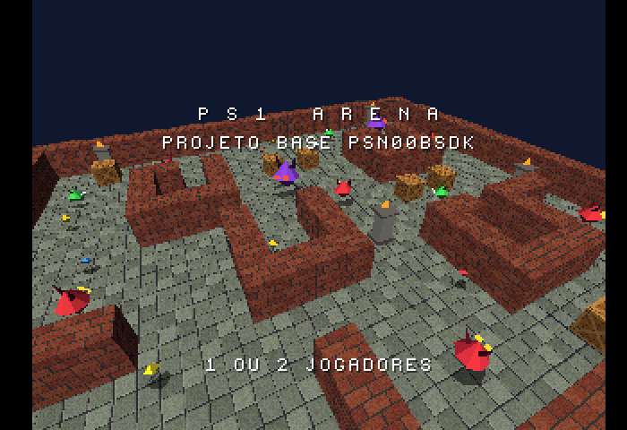
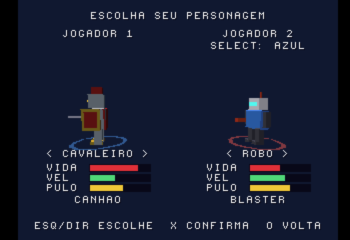
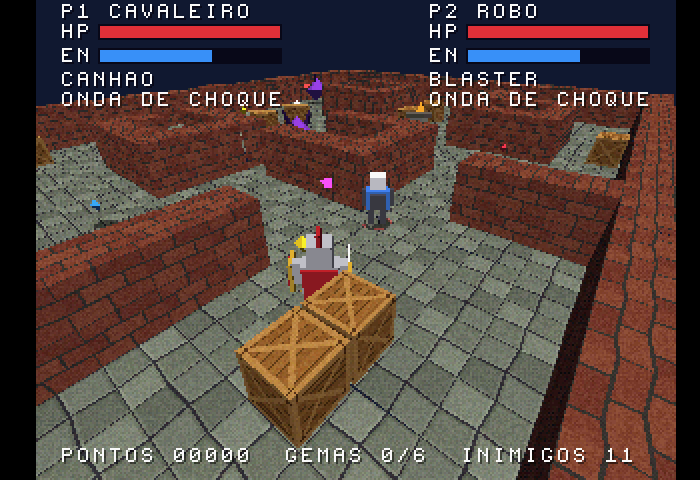
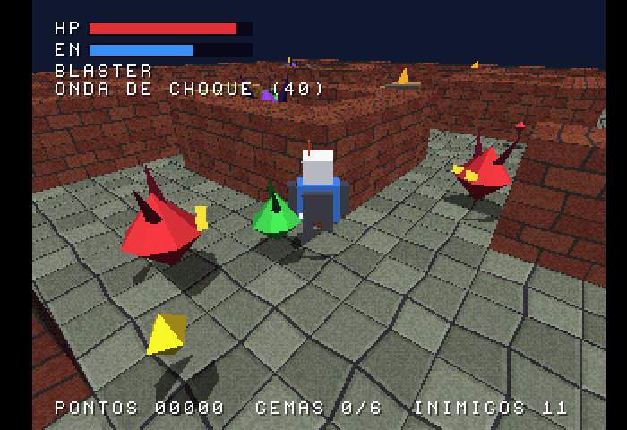
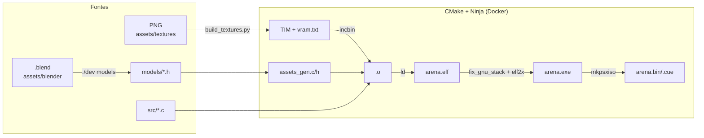
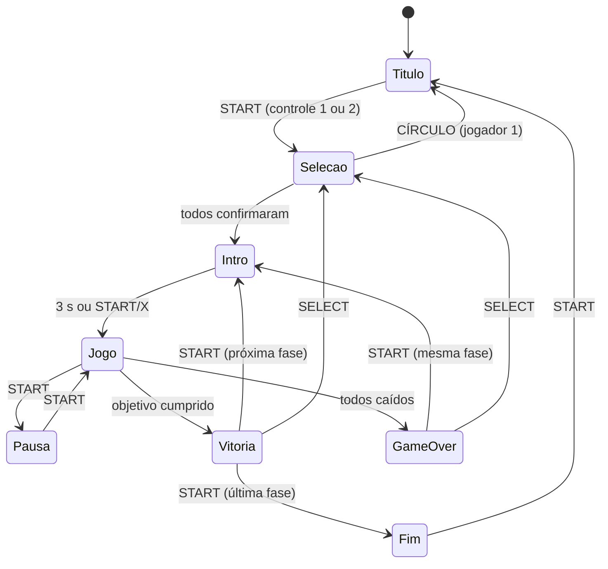

# PS1 Arena

**Um jogo 3D completo para PlayStation 1, feito em C, para estudar e modificar.**

Arena em terceira pessoa com seleção de personagem, até 2 jogadores, inimigos,
armas, poderes, itens, colisão e cenário montado a partir de um mapa em texto —
com um pipeline que leva modelos do **Blender** e imagens **PNG** direto para o
jogo. Roda em emuladores e em console real (CD-R).


| Título | Seleção de personagem | 2 jogadores | Jogo |
|---|---|---|---|
|  |  |  |  |

> 📘 **Quer só mudar o jogo?** O [Guia prático](docs/GUIA.md) tem receitas
> passo a passo: personagem novo, mapa, texturas, armas, poderes, inimigos.
> Este README é a referência técnica: ambiente, build, arquitetura, rede e manutenção.

---

## Sumário

- [Recursos](#recursos)
- [Início rápido](#início-rápido)
- [Configurando o ambiente](#configurando-o-ambiente)
- [Compilando](#compilando)
- [Executando](#executando)
- [Estrutura do repositório](#estrutura-do-repositório)
- [Arquitetura técnica](#arquitetura-técnica)
- [Rede e jogo online](#rede-e-jogo-online)
- [Recomendações para desenvolvedores](#recomendações-para-desenvolvedores)
- [Manutenção](#manutenção)
- [Solução de problemas](#solução-de-problemas)
- [Licença, créditos e avisos](#licença-créditos-e-avisos)

---

## Recursos

**Jogo**
- **4 fases** com objetivos diferentes (derrotar todos, chegar à saída, coletar itens, sobreviver),
  tela de introdução e progressão; câmera em terceira pessoa que segue o grupo.
- **Seleção de personagem** com modelo 3D girando e atributos (vida, velocidade, pulo, arma).
  Três personagens incluídos: Robô (com 5 skins), Cavaleiro e Batedor.
- **1 ou 2 jogadores** cooperativo (controles nas portas 1 e 2), com respawn ao lado do parceiro.
- 4 armas (com mira automática), 3 poderes, 4 tipos de inimigo (um deles atira), gemas, itens, caixas destrutíveis
  e objetos de cenário.
- **Colisão entre tudo**: paredes, caixas, cenário, jogadores e inimigos. Pular passa por cima dos inimigos.
- **Clima de terror:** névoa por profundidade da GTE, escuridão por fase e **lanterna** com bateria
  (cone de luz aditivo; vê-se mais longe no cone).
- **Som posicional** no SPU: passos, tiros, acertos, inimigos que rosnam fora da tela, vento e grilos em loop.

**Motor e ferramentas**
- Renderização 3D na GTE com iluminação, texturas (4/8/16 bits), ordenação por Ordering Table,
  descarte por frustum e por face, geometria da fase agrupada em blocos.
- Lógica em **passo fixo de 60 Hz**, independente da taxa de quadros.
- Jogo **orientado a dados**: personagens, armas, poderes, inimigos, skins e cenário são linhas de tabela.
- **Pipeline de assets automático**: PNG → TIM com alocação de VRAM; WAV → VAG; Blender → modelos C; tudo
  descoberto pelo CMake sem editar arquivos de build.
- Exportador do Blender (menu *File → Export* e linha de comando), `.blend` de exemplo com todos os modelos.
- Ambiente reproduzível em **Docker**, script único `./dev`, integração com **VS Code**.

---

## Início rápido

Pré-requisitos: Docker funcionando (no Windows, via WSL2) e Git.

```bash
git clone <url-deste-repositório> psx-arena
cd psx-arena
./dev build      # 1ª vez: cria a imagem do SDK (alguns minutos)
```

Saída em `build/`: `arena.exe` (emuladores) e `arena.bin` + `arena.cue` (imagem de CD).
Para ver o jogo sem compilar, use os arquivos de [`prebuilt/`](prebuilt/).

---

## Configurando o ambiente

### Requisitos

| Componente | Versão | Observação |
|---|---|---|
| Docker | 20+ | Docker Desktop (Windows/macOS) ou Docker Engine (Linux) |
| Bash | 4+ | para o script `./dev` (WSL, Linux, macOS) |
| Blender | 2.93+ (testado no 5.2) | opcional — só para criar/editar modelos |
| Emulador de PS1 | — | PCSX-Redux (sem BIOS) ou DuckStation/ePSXe (com BIOS) |
| Python 3 + Pillow | — | só se compilar **sem** Docker |

O que roda dentro da imagem Docker (Ubuntu 24.04): GCC `mipsel-linux-gnu` 12.4, CMake 3.28,
Ninja, Python 3 + Pillow e o **PSn00bSDK 0.24** compilado a partir de um commit fixo
(definido no [`Dockerfile`](Dockerfile)).

### Windows + WSL2 + Docker (recomendado)

1. **WSL2 com Ubuntu**: `wsl --install -d Ubuntu` no PowerShell (como administrador).
2. **Docker**, uma das opções:
   - Docker Desktop → *Settings → Resources → WSL Integration* → ative a distro Ubuntu; ou
   - Docker Engine dentro do Ubuntu:
     ```bash
     sudo apt update && sudo apt install -y docker.io
     sudo usermod -aG docker $USER     # feche e reabra o terminal
     sudo service docker start
     ```
3. **Clone dentro do sistema de arquivos do Linux** (`~/`), não em `/mnt/c/...` — a diferença
   de desempenho de I/O é grande.
4. Teste: `./dev doctor` mostra o estado do Docker, do emulador e do Blender.

### Linux

Instale o Docker Engine pela distribuição e adicione seu usuário ao grupo `docker`.
Depois, `./dev build`.

### macOS

Docker Desktop + `./dev build`. Em Macs com Apple Silicon, se a imagem não compilar
nativamente, force a arquitetura Intel com `DOCKER_DEFAULT_PLATFORM=linux/amd64 ./dev image`
(roda emulado, mais lento). *Não testado no macOS.*

### Sem Docker (Ubuntu/Debian/WSL)

```bash
./scripts/setup-linux.sh          # instala o compilador e compila o SDK em /opt/psn00bsdk
echo 'USE_DOCKER=0' >> dev.conf   # o ./dev passa a usar o SDK local
./dev build
```

### Windows nativo (avançado)

Possível com os binários do PSn00bSDK para Windows, o GCC `mipsel-none-elf`, CMake, Ninja e
Python + Pillow (veja [`doc/installation.md`](https://github.com/Lameguy64/PSn00bSDK/blob/master/doc/installation.md)
do SDK). Defina `PSN00BSDK_LIBS` e o `PATH` e use `cmake --preset default` + `cmake --build ./build`.
O script `./dev` não é usado nesse caso.

### VS Code

Abra a pasta pelo WSL (`code .` no terminal do Ubuntu, com a extensão *WSL*).
O repositório já inclui em [`.vscode/`](.vscode/):

- **Ctrl+Shift+B** compila; erros aparecem clicáveis no painel *Problems*.
- Tarefas: compilar e rodar, exportar modelos, *watch*, limpar, mapa da VRAM.
- Autocompletar do C para o PSn00bSDK (os cabeçalhos do SDK são copiados da imagem para
  `.sdk/` no primeiro build).

### Configuração pessoal (`dev.conf`)

Criado automaticamente a partir de [`dev.conf.example`](dev.conf.example) e ignorado pelo Git.

| Variável | Uso |
|---|---|
| `EMULATOR` | caminho do emulador (no WSL: `/mnt/c/...`) usado por `./dev run` |
| `EMULATOR_ARGS` | argumentos antes do arquivo (PCSX-Redux: `-run -loadexe`) |
| `RUN_FILE` | `exe` ou `cue` |
| `BLENDER` | caminho do Blender; vazio = procura em `C:\Program Files\Blender Foundation` |
| `USE_DOCKER` | `1` (padrão) compila no Docker; `0` usa o SDK local |

---

## Compilando

```bash
./dev build            # compila (incremental)
./dev clean            # apaga build/
VERBOSE=1 ./dev build  # mostra também as mensagens normalmente filtradas
```

Equivalente manual (dentro do ambiente do SDK — `./dev shell` abre um terminal nele):

```bash
cmake --preset default -DPSN00BSDK_TARGET=mipsel-linux-gnu   # ou mipsel-none-elf
cmake --build ./build
```

| Saída | Descrição |
|---|---|
| `build/arena.exe` | executável PS-EXE (~96 KB) |
| `build/arena.bin` + `.cue` | imagem de CD ISO 9660 gerada pelo `mkpsxiso` |
| `build/arena.elf` / `.map` | ELF com símbolos e mapa de símbolos, para depuração |
| `build/gen/assets_gen.{h,c}` | declarações geradas dos modelos e texturas |
| `build/textures/` | TIMs gerados + `vram.txt` (mapa da VRAM) |

O preset usa `CMAKE_BUILD_TYPE=Release` (`-O2`). Para depurar com mais fidelidade ao código,
troque para `Debug` em [`CMakePresets.json`](CMakePresets.json) (`-Og`).

### Comandos do `./dev`

| Comando | Faz |
|---|---|
| `build` | compila (padrão) |
| `run [exe\|cue]` | compila e abre no emulador configurado |
| `models` | exporta todos os `.blend` de `assets/blender/` para `models/` (Blender do Windows ou Linux) |
| `watch` | recompila a cada arquivo salvo em `src/`, `models/`, `assets/` |
| `vram` | mostra a posição de cada textura na VRAM |
| `shell` | terminal dentro do ambiente do SDK |
| `image` | recria a imagem Docker |
| `doctor` | verifica Docker, SDK, emulador e Blender |
| `clean` | apaga `build/` |

---

## Executando

| Emulador | Arquivo | BIOS |
|---|---|---|
| PCSX-Redux | `.exe` ou `.cue` | não precisa |
| DuckStation (PC/Android) | `.exe` ou `.cue` | precisa |
| ePSXe, RetroArch (Beetle PSX, SwanStation, PCSX ReARMed) | `.cue` | geralmente precisa |
| Mednafen | `.cue` com `-force_module psx` | precisa |

`./dev run` compila e abre o emulador definido no `dev.conf`; no WSL o caminho do arquivo é
convertido para `\\wsl.localhost\...`. **2 jogadores:** configure um controle na porta 2 do
emulador e aperte Start nele na tela de seleção.

**Console real:** grave `arena.cue` num CD-R; o console precisa de modchip ou softmod
(Tonyhax International, FreePSXBoot, Unirom). Detalhes no [Guia](docs/GUIA.md#15-gravar-em-cd-e-jogar-no-console).

---

## Estrutura do repositório

```
psx-arena/
├── CLAUDE.md                instruções para agentes de IA (Claude Code) — ver docs/HISTORICO.md
├── dev                      script de desenvolvimento (Bash)
├── dev.conf.example         modelo da configuração pessoal
├── Dockerfile               ambiente de build (Ubuntu 24.04 + GCC MIPS + PSn00bSDK)
├── CMakeLists.txt           build: descobre código e assets, gera declarações, monta o CD
├── CMakePresets.json        preset do PSn00bSDK
├── iso.xml / system.cnf     conteúdo e boot do CD
├── src/
│   ├── main.c               laço principal, estados, câmera, HUD, tela de seleção
│   ├── config.h             constantes globais
│   ├── game.h               tipos, estado global e protótipos
│   ├── data.c               tabelas: personagens, armas, poderes, inimigos, skins, cenário
│   ├── levels.c             tabela de fases (mapas em texto, aparência, objetivo)
│   ├── level.c              leitura do mapa, geração de geometria, colisão com o mapa
│   ├── objective.c          objetivos, saída (X) e reforços (S)
│   ├── player.c             jogadores (até 2), respawn
│   ├── enemies.c            IA dos inimigos
│   ├── weapons.c            projéteis e mira automática
│   ├── powers.c             poderes
│   ├── items.c              itens, caixas, efeitos, sombras, objetos de cenário
│   ├── collision.c          colisão por círculos entre todas as entidades
│   ├── render.c / render.h  motor 3D (GTE + GPU)
│   ├── mesh.h               formato de modelo
│   ├── input.c              controles (portas 1 e 2)
│   ├── mathutil.c           atan2, distâncias e utilidades em inteiros
│   ├── rng.c                gerador aleatório determinístico (xorshift32)
│   ├── sound.c / sound.h    efeitos sonoros no SPU (vozes, prioridade, som posicional)
│   └── models.h             inclui as declarações geradas
├── models/                  modelos exportados (.h) — gerados, mas versionados
├── assets/
│   ├── blender/             fontes .blend (exemplos.blend tem todos os modelos)
│   ├── textures/            PNGs (convertidos no build)
│   ├── sounds/              WAVs (convertidos para VAG no build)
│   └── tim/                 TIMs prontos (opcional)
├── tools/
│   ├── blender_export_psx.py   exportador Blender → MESH (biblioteca + operador + CLI)
│   ├── export_blend.py         exportação em lote de um .blend (usado por ./dev models)
│   ├── build_textures.py       PNG → TIM com empacotamento de VRAM (usado pelo CMake)
│   ├── make_forest_textures.py texturas provisórias da floresta (terra, folhas, raízes, mata)
│   ├── wav2vag.py              WAV → VAG (encoder SPU-ADPCM em Python puro; usado pelo CMake)
│   ├── make_placeholder_sounds.py  gera os sons provisórios sintetizados
│   ├── png2tim.py              conversor manual com posição de VRAM explícita
│   ├── fix_gnu_stack.py        corrige o ELF do GCC mipsel-linux-gnu antes do elf2x
│   ├── make_default_assets.py  gera os modelos e texturas padrão por código
│   └── make_example_blend.py   gera assets/blender/exemplos.blend
├── scripts/setup-linux.sh   instalação do SDK sem Docker
├── .vscode/                 tarefas, IntelliSense e configurações
├── docs/                    guia prático, histórico de decisões e capturas de tela
└── prebuilt/                arena.exe/.bin/.cue compilados
```

---

## Arquitetura técnica

### Visão geral



### O hardware em uma tabela

| | PlayStation 1 | Consequência no código |
|---|---|---|
| CPU | MIPS R3000A, 33,8 MHz, **sem FPU** | tudo em inteiros e ponto fixo (`ONE = 4096` = 1.0) |
| RAM | 2 MB | sem `malloc`: pools estáticos de tamanho fixo |
| VRAM | 1 MB (1024×512 × 16 bits) | telas, texturas e fonte dividem o espaço |
| GTE | coprocessador de geometria | rotação, perspectiva e luz de 3 vértices por instrução |
| GPU | rasterizador 2D, **sem Z-buffer** | ordenação por Ordering Table; sem correção de perspectiva nas texturas |

### Laço principal e passo fixo



A cada quadro, `main()` conta quantos retraços verticais se passaram (`VSync(-1)`) e roda
`game_tick()` essa quantidade de vezes (1 a 4), depois desenha uma vez com `game_draw()`.
A lógica roda sempre a **60 passos por segundo**, mesmo quando o desenho cai para 30 FPS em
cenas pesadas — o jogo não fica em câmera lenta. Botões "apertados agora" (`pressed`) valem
para um único passo.

Separação de responsabilidades: `*_update()` só altera estado; `*_draw()` só desenha. A câmera
é calculada na lógica (`camera_update`) e aplicada no desenho (`camera_apply`).

### Renderização (`render.c`)

1. **Double buffer:** duas áreas de 320×240 na VRAM (x 0–319 e 320–639). Enquanto a GPU desenha
   uma, a CPU monta a outra.
2. **Ordering Table** de 2048 entradas, em ordem reversa (`ClearOTagR`). Cada polígono entra na
   posição da sua profundidade média (`gte_avsz3/4`, Z/4); a GPU desenha do fundo para a frente.
   Entradas 0 e 1 são reservadas para o HUD. `DRAWOPT.zbias` desloca objetos (o chão usa +6,
   sombras +2) para evitar disputa de ordem.
3. **Por modelo** (`render_mesh`):
   - descarte por esfera contra a pirâmide de visão (frente, laterais, topo/base) usando o raio do modelo;
   - matriz modelo→câmera com `RotMatrix` + `ScaleMatrix` + `CompMatrixLV`; matriz de luz no espaço do modelo.
4. **Por face:** `gte_rtpt` projeta 3 vértices; `gte_nclip` descarta faces de costas; faces com
   vértice antes do plano próximo (`NEAR_Z`) ou com coordenadas fora do limite da GPU são
   descartadas, assim como as que estão inteiras além do `fog_far`; `gte_ncds` calcula a cor
   iluminada (ambiente + 1 luz direcional) já misturada com a névoa, e `gte_dpcs` faz só a névoa
   nas faces sem luz. Primitivas:
   `POLY_F3/F4` (cor) e `POLY_FT3/FT4` (texturizadas), com semitransparência opcional.
5. **Memória de primitivas:** 96 KB por buffer (`PACKET_LEN`); o desenho para com segurança se
   acabar. O HUD (L2) mostra o uso por quadro.
6. **Mundo em blocos sob demanda (`level.c` + `render_chunk`):** grade de até 128×128 células
   (1 byte: tipo + bit de sólido). A geometria é montada em blocos de 8×8 células num cache de 36:
   o 3×3 em volta de cada jogador é montado no mesmo quadro; o resto do 5×5 do grupo entra numa
   fila de 1 bloco por quadro; o mais distante é reaproveitado. Todo vértice de um bloco é um ponto
   da grade (9×9 posições × 5 alturas), então **uma tabela única de 405 vértices** serve para todos
   e cada quad guarda só índices, 4 cores e textura (30 bytes). Normais fixas: a luz é calculada na
   montagem (mesma fórmula do `nccs`) e gravada na cor dos vértices; no desenho, por quad: `rtpt` +
   `rtps`, `nclip`, `NEAR_Z`/névoa, `avsz4`, névoa nas cores com `dpct` (3 cores) + `dpcs` (a
   quarta) → `POLY_GT4`. Vértices relativos à origem do bloco (`load_translation`): o mapa vai a
   32 768 unidades e estouraria um `SVECTOR`.
7. **HUD:** retângulos (`TILE`) e texto via `FntSort`, inseridos nas entradas 0/1 da OT.
8. **Névoa (depth cueing):** a cada projeção a GTE calcula `IR0 = (H·65536/z·DQA + DQB)/4096`
   (0..4096). `render_set_fog()` escolhe DQA/DQB (registradores de controle 27/28, gravados por uma
   macro própria `gte_SetDepthCue`, porque o SDK não tem) para `IR0` = 0 no `near` e 4096 no
   `far`; `gte_SetFarColor` = cor do céu, que também é a cor de fundo. A conta é em 1/z: a névoa
   engrossa logo depois do `near`. É por face (o `IR0` do último vértice projetado). As contas
   evitam 64 bits (que puxariam a libgcc) limitando `near ≥ 256` e `far − near ≥ far/8`.
9. **Lanterna:** objetos cujo centro está no cone de uma lanterna acesa usam um segundo par
   DQA/DQB (névoa 1,6× mais longe); os blocos do mapa (`DRAW_FIXEDFOG`) ficam de fora. O cone no
   chão é um leque de `POLY_G3` em modo **aditivo** (ponta clara, borda preta). Polígonos sem
   textura usam o modo de mistura da última *texture page*, então cada triângulo vai na OT entre
   dois `DR_TPAGE` (aditivo antes, 50% depois — senão as sombras seriam somadas e sumiriam). O
   índice na OT usa o vértice mais próximo menos meia célula, para o chão não cobrir a ponta.

### Coordenadas, unidades e ponto fixo

- Eixos do PS1: **X** direita, **Y para baixo**, **Z** para frente. "Subir" é Y negativo.
- 256 unidades = 1 metro = 1 célula do mapa. Ângulos: 4096 = 360° (`isin`/`icos` retornam ×4096).
- Valores fracionários são inteiros escalados; multiplicações são seguidas de `>> 12`.
- Sem `float`, sem `double`, sem divisão em laços quentes sempre que possível.

### Formato de modelo (`mesh.h`)

```c
typedef struct {
    uint16_t v[4];          // índices; quads em ordem "Z" (v0 v1 / v2 v3)
    uint8_t  r, g, b;       // cor (texturizado: 128 = neutro)
    uint8_t  flags;         // FACE_QUAD | FACE_TEXTURED | FACE_UNLIT
    uint8_t  mat, pad;      // slot de material (para paletas/skins)
    uint8_t  uv[8];         // u,v por vértice, em texels
    uint16_t n;             // índice da normal da face
} MESH_FACE;                // 24 bytes
```

O exportador converte do Blender (Z para cima, frente −Y) com uma **rotação pura**
`(x, y, z) → (−x, −z, −y)` — não espelha o modelo — e inverte a ordem dos vértices, porque a
GTE considera "de frente" a ordem horária na tela. Quads do Blender (ordem circular `a b c d`)
viram `a d b c` (ordem "Z" do PS1). Normais são por face, normalizadas para 4096.

Os modelos são gerados como `.h` com dados `static const` e incluídos uma única vez em
`build/gen/assets_gen.c`; o nome do arquivo define o símbolo (`models/heroi.h` → `heroi_mesh`).

### Texturas e VRAM

| Região da VRAM (x, y) | Uso |
|---|---|
| (0–639, 0–239) | duas telas (double buffer) |
| (640–959, 0–479) | texturas — alocadas pelo `build_textures.py` |
| (640–959, 480–511) | paletas (CLUT) das texturas de 4/8 bits |
| (960–1023, …) | fonte do sistema (`FntLoad`) |

`build_textures.py` converte cada PNG (16, 8 ou 4 bits, conforme o sufixo do nome), empacota
em "prateleiras" garantindo que nenhuma textura cruze o limite de página (y = 256) e que
`u0 + largura ≤ 256` dentro da página, e grava `vram.txt`. Em tempo de execução,
`render_load_texture` lê a posição do próprio TIM e calcula `tpage`, `clut` e os deslocamentos
de UV — por isso a posição pode mudar a cada build sem quebrar nada.

### Som (`sound.c`)

- **Formato:** VAG = cabeçalho de 48 bytes (big-endian) + SPU-ADPCM: blocos de 16 bytes com 28
  amostras de 4 bits, um de 5 filtros de previsão e um *shift* por bloco. Flags nos blocos marcam
  fim (1), repetição (2) e início de loop (4). `tools/wav2vag.py` escolhe, por bloco, a combinação
  filtro/shift de menor erro, reproduzindo o decodificador do SPU.
- **Memória:** 16 bytes a cada 28 amostras → **~12,6 KB/s a 22 050 Hz**. As amostras vão
  embutidas no EXE (`incbin`) e são copiadas por DMA para a RAM do SPU no boot, a partir de
  `0x1010` (os primeiros 4 KB são reservados). Ou seja: ocupam RAM principal *e* do SPU.
- **Vozes:** 0–1 para loops de ambiente; 2–23 em rodízio. Como o SDK não expõe o registrador ENDX,
  o fim de cada som é estimado pela duração (calculada no carregamento) contra `VSync(-1)`. Sem voz
  livre, rouba a de menor prioridade (tabela `sound_defs`), ou descarta o som novo.
- **Posicional:** volume linear de `SOUND_NEAR` a `SOUND_FAR` pela distância até `g.cam_pos`; pan
  pelo seno do ângulo relativo a `g.cam_yaw` (o lado oposto cai até 25%).
- **Determinismo:** o módulo só lê `g`. Variações (tom, rosnados) usam `fx_range`.
- **Cabeçalho big-endian:** convertido com `be32()` byte a byte. `__builtin_bswap32` chamaria uma
  rotina da libgcc compilada com outro ABI e o jogo trava no boot.

### Colisão (`collision.c`)

Tudo que ocupa espaço no chão é um **círculo** no plano X/Z: jogadores (`PLAYER_RADIUS`),
inimigos (raio × escala do tipo) e objetos de cenário (raio calculado dos vértices do modelo na
carga). Paredes e caixas são células sólidas do mapa (`level_blocked`).

`collide_move()` testa X e Z separadamente (deslizar em paredes) e aplica três regras para
nunca travar: ignora o próprio objeto; quando dois círculos já estão sobrepostos, só bloqueia o
movimento que os **aproxima**; e entidades com diferença de altura maior que `JUMP_CLEAR`
(alguém no alto de um pulo) não colidem. Projéteis testam paredes, caixas, cenário e o "outro
lado": cada `BULLET` tem um `owner` (`OWNER_PLAYER`/`OWNER_ENEMY`) — tiro de jogador só acerta
inimigos, tiro de inimigo só acerta jogadores (e passa por baixo de quem pula alto). Os dois
dividem o pool `g.bullets` (`MAX_BULLETS`). Atiradores checam linha de visão (amostras a cada
64 unidades contra o mapa e objetos sólidos) só a cada 8 passos, escalonado por inimigo.
Custo: O(jogadores + inimigos + objetos) por movimento — trivial para os limites atuais
(2 + 24 + 64).

### Fases, objetivos e progressão

- `level_defs` (`levels.c`) descreve cada fase: mapa, texturas, céu, faixa de música (reservada
  para a etapa 01b), objetivo, parâmetro, limite de inimigos e texto da introdução.
- `objective.c`: `objective_start()` no fim do `game_reset`, `objective_update()` a cada passo
  (devolve 1 na vitória), `objective_text()` para o HUD. Com `X` no mapa, o objetivo cumprido
  abre a saída. Reforços do SURVIVE usam `g.rng` (determinístico).
- Estados novos no fim do enum: `STATE_INTRO` (3 s, START/X pulam) e `STATE_END`.
- Progressão: `progress` (fora de `g`, como `sel[]`, porque o `memset` apaga `g`) guarda pontos,
  vida, energia, armas e poder ao vencer; `start_level()` aplica depois do `game_reset`. O game
  over recomeça a fase com esse mesmo retrato. `DEBUG_START_LEVEL` (`config.h`) pula fases.

### Entidades e dados

- Estado global único `GAME g` (em `main.c`), zerado a cada partida; a seleção de personagens fica
  fora dele e sobrevive entre partidas.
- Entidades em **pools estáticos** com flag `active` (`MAX_ENEMIES`, `MAX_BULLETS`, …).
- **Orientação a dados:** comportamento definido por tabelas em `data.c`. Poderes são ponteiros
  de função `void (*)(PLAYER *)`; inimigos e objetos de cenário são associados a caracteres do mapa.
- **Aleatoriedade determinística** (`rng.c`): xorshift32 com estado explícito. A lógica sorteia só
  com `g.rng` (via `rand_range`), semeado por `game_reset(seed)` com `g.seed`; efeitos puramente
  visuais usam `fx_range`, um gerador separado fora de `g`. Assim a mesma semente + as mesmas
  entradas reproduzem a partida — requisito do modo link. `DEBUG_FIXED_SEED` (`config.h`) força
  uma semente para testes. O overlay **L2** mostra `SEED` e `POLIS` (polígonos enviados à GPU).

### Memória (build atual)

| Seção | Tamanho | Conteúdo principal |
|---|---|---|
| `.text` | ~82 KB | código do jogo + bibliotecas do SDK usadas |
| `.data` | ~115 KB | modelos, texturas e sons embutidos, tabelas |
| `.bss` | ~510 KB | 2 × 96 KB de primitivas, 2 × OT, cache de 36 blocos (~277 KB), grade 128×128 (16 KB), pools |
| **Total** | **~707 KB** de 2 MB | orçamento do roteiro: 1,2 MB |

Medido com `mipsel-linux-gnu-size build/arena.elf` (dentro do `./dev shell`).

### Por que existe `fix_gnu_stack.py`

O GCC do Ubuntu (`mipsel-linux-gnu`) gera um cabeçalho `PT_GNU_STACK` no endereço 0. O `elf2x`
do SDK interpreta isso como parte do programa e tenta gerar um executável de ~2 GB. O CMake, ao
detectar esse compilador, troca o `elf2x` por um invólucro que remove o cabeçalho antes da
conversão. Com o compilador `mipsel-none-elf` (bare-metal) a correção não é aplicada.

---

## Rede e jogo online

**O PlayStation 1 não tem rede, e nenhum emulador popular emula uma placa de rede para ele.**
O jogo não tenta acessar a internet e se comporta igual offline e "online". Opções reais:

| Modo | Como | Situação |
|---|---|---|
| Local, 2 jogadores | dois controles (portas 1 e 2) | ✅ implementado |
| Online via streaming | quem hospeda roda o emulador e compartilha com **Parsec**; o controle do convidado vira a porta 2 | ✅ funciona sem mudar o jogo |
| Netplay do RetroArch | — | ❌ o [FAQ de netplay do libretro](https://github.com/libretro/docs/blob/master/docs/guides/netplay-faq.md) informa que PS1 não funciona |
| Link pela porta serial | cabo link no console; no PCSX-Redux, *SIO1 Server/Client* ligam dois emuladores por TCP | 🔧 não implementado (proposta abaixo) |

### Proposta de modo link (para quem quiser implementar)

A porta serial (SIO1) é acessível pela biblioteca `psxsio` do PSn00bSDK. Um modo cooperativo
pela serial seria um **lockstep**: cada lado envia o estado do próprio controle a cada passo e
só avança a simulação quando recebe o do outro.

O projeto já tem a maior parte do que isso exige:
- simulação determinística em passo fixo (`game_tick`), sem dependência de tempo real;
- entrada isolada em `INPUT in[2]` — o controle remoto entraria como a porta 2.

O que faltaria:
1. handshake e troca da **semente** `g.seed` (hoje vem de `g.frame` ao iniciar a partida);
2. atraso de entrada fixo (ex.: 2–4 passos) para absorver a latência;
3. pacote por passo `{número do passo, botões, analógicos}` e espera pelo pacote remoto;
4. *checksum* periódico do estado para detectar dessincronia;
5. trocar o laço de 1–4 passos por quadro por "avança quando os dois lados tiverem a entrada".

---

## Recomendações para desenvolvedores

**Fluxo**
- Edite → `./dev run` → teste. Use `./dev watch` em um terminal enquanto edita.
- Mudanças de jogo começam por `data.c` e `config.h`; só mexa no motor (`render.c`,
  `collision.c`) quando a tabela não for suficiente.
- Teste em pelo menos dois emuladores, sendo um preciso (DuckStation ou PCSX-Redux), e,
  quando possível, em console real — emuladores perdoam memória não inicializada, temporização
  da GPU e acessos fora de alinhamento.

**Código**
- C (GNU11), indentação com tabs, comentários em português — o projeto é didático, mantenha
  os comentários explicando o *porquê*.
- Nada de `float`/`double`, `malloc` ou recursão profunda. Pools estáticos com flag `active`.
- Cuidado com estouro de inteiro em produtos de coordenadas: valores até ~32 000 ao quadrado
  já passam de 2³⁰.
- Funções `*_update` não desenham; funções `*_draw` não mudam estado do jogo.
- Texto exibido no jogo: só ASCII maiúsculo/minúsculo sem acentos (fonte do sistema).

**Desempenho**
- Orçamento prático: ~1500–3000 polígonos por quadro a 30 FPS. Ative o overlay com **L2**
  (FPS e bytes de primitivas por quadro).
- Modelos de personagem: até ~500 faces. Prefira texturas de 64×64/128×128 e 4/8 bits.
- Polígonos grandes perto da câmera são descartados (não há recorte); subdivida faces grandes.

**Depuração**
- `printf` vai para o TTY da BIOS: o PCSX-Redux mostra no console dele.
- O PCSX-Redux tem servidor GDB e visualizadores de VRAM, memória e GPU.
- `build/arena.map` lista os endereços de todos os símbolos.

**Git**
- Versione os `.blend` **e** os `models/*.h` gerados: assim o projeto compila sem o Blender.
- Não versione `build/`, `.sdk/` nem `dev.conf` (já estão no `.gitignore`).
- O [`.gitattributes`](.gitattributes) força finais de linha LF nos scripts — essencial para
  quem clona no Windows (um `dev` com CRLF não executa no Bash).
- Arquivos `.blend` e texturas grandes podem ir para o **Git LFS** se o repositório crescer.
- Prefira publicar builds em **Releases** do GitHub em vez de versionar `prebuilt/`.

---

## Manutenção

### Atualizar o PSn00bSDK

1. Troque o commit em `PSN00BSDK_COMMIT` no [`Dockerfile`](Dockerfile) e em
   [`scripts/setup-linux.sh`](scripts/setup-linux.sh).
2. `./dev image && ./dev clean && ./dev build`.
3. Rode a lista de verificação abaixo. Pontos sensíveis a mudanças do SDK: assinaturas de
   `FntSort`, `InitPAD`, macros da GTE em `inline_c.h` e o formato das funções CMake
   (`psn00bsdk_add_executable`, `psn00bsdk_target_incbin`).

### Atualizar a imagem base / compilador

A imagem usa `ubuntu:24.04`. Ao trocar de versão, confira se o pacote `gcc-mipsel-linux-gnu`
continua disponível e se o `fix_gnu_stack.py` ainda é necessário (`readelf -l build/arena.elf`).

### Regenerar os assets padrão

```bash
python3 tools/make_default_assets.py                      # models/*.h e assets/textures/*.png
blender --background --python tools/make_example_blend.py # assets/blender/exemplos.blend
```

Só é necessário ao mudar os modelos padrão por código; o fluxo normal é editar no Blender.

### Lista de verificação de release

- [ ] `./dev clean && ./dev build` sem erros nem avisos novos
- [ ] Título → seleção → partida com 1 jogador
- [ ] Seleção com 2 controles, personagens diferentes, partida cooperativa e respawn
- [ ] As 4 fases em sequência (cada objetivo vence); game over recomeça a fase; fim de jogo volta ao título
- [ ] Overlay L2: FPS estável e memória de primitivas abaixo do limite
- [ ] `arena.cue` inicia em DuckStation e PCSX-Redux
- [ ] Atualizar `prebuilt/` ou anexar `arena.cue`/`arena.bin` à Release

### Limitações conhecidas

- Sem música ainda (CD-DA chega na etapa 01b do `docs/ROADMAP.md`).
- Sem recorte de polígonos no plano próximo: faces muito perto da câmera somem.
- Ordenação por profundidade média: sobreposições erradas ocasionais em polígonos grandes
  (comportamento típico do PS1).
- Inimigos perseguem em linha reta (sem pathfinding) e contornam obstáculos de forma simples.
- Fases embutidas no executável (sem carregamento do CD); mapas de até 128×128, sem relevo.

---

## Solução de problemas

| Problema | Solução |
|---|---|
| `Docker não está respondendo` | abra o Docker Desktop (confira *WSL Integration*) ou `sudo service docker start` |
| `permission denied ... docker.sock` | `sudo usermod -aG docker $USER` e reabra o terminal |
| `./dev: Permission denied` | `chmod +x dev` |
| `/usr/bin/env: 'bash\r'` | finais de linha CRLF: `sed -i 's/\r$//' dev` (e veja o `.gitattributes`) |
| build muito lento | o projeto está em `/mnt/c`; mova para `~/` |
| `Emulador não configurado` | preencha `EMULATOR` no `dev.conf` (`./dev doctor` confere) |
| tela preta no emulador | configure um BIOS real; no Mednafen use `-force_module psx` |
| modelo novo não existe no código | o símbolo vem do nome do arquivo: `models/heroi.h` → `heroi_mesh` |
| modelo "do avesso" ou some | normais invertidas: no Blender, *Mesh → Normals → Recalculate Outside* |
| `Vértice fora do limite de 16 bits` | modelo grande demais para a escala; reduza |
| `VRAM cheia` | texturas demais/grandes; use os sufixos `-8bit`/`-4bit` |
| estado estranho após muitas mudanças | `./dev clean && ./dev build` |

Mais casos no [Guia prático](docs/GUIA.md).

---

## Licença, créditos e avisos

**Autor:** Marcos Nobre.

**Licença:** este projeto ainda não tem licença definida. Até que um arquivo `LICENSE` seja
adicionado, todos os direitos são reservados ao autor.

**Dependências e créditos**
- [PSn00bSDK](https://github.com/Lameguy64/PSn00bSDK) — SDK livre para PlayStation 1 (MPL-2.0),
  inclui `mkpsxiso` e `elf2x`.
- [PCSX-Redux](https://github.com/grumpycoders/pcsx-redux) — emulador e OpenBIOS usados nos testes.
- [Blender](https://www.blender.org/) — modelagem.

Assets de terceiros (sons, texturas, modelos) ficam listados em [`CREDITS.md`](CREDITS.md).

**Avisos**
- *PlayStation* é marca registrada da Sony Interactive Entertainment. Este é um projeto
  independente, sem afiliação ou endosso da Sony.
- Nenhum código, BIOS ou dado da Sony é distribuído. O arquivo de licença do disco não é incluído;
  BIOS para emuladores deve ser extraído do seu próprio console.
